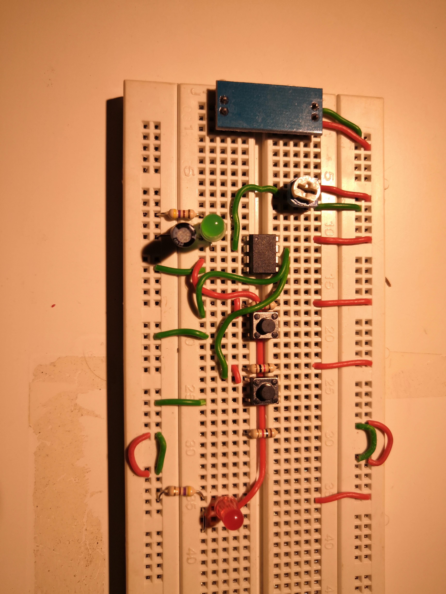

# ATTiny clock/pulse module
This is a clock module based on Arduino ATTiny85 with adjustable resolution. It operates in 3 modes: Astable, Monostable and Bistable.

### Components
	1 x ATTiny85
	2 x tact switches
	1 x 10uF Electrolytic Cap
	3 x k22 Resistor
	2 x 1k Resistor
	1 x variable pot

## The module

### References
[Programming ATTiny85 using Arduino](https://create.arduino.cc/projecthub/arjun/programming-attiny85-with-arduino-uno-afb829)
